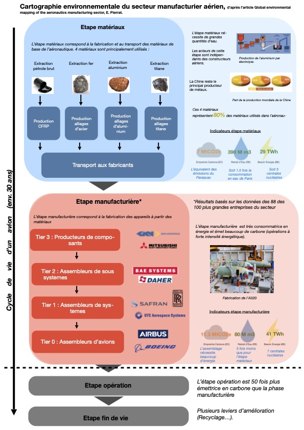

# AD_EnvironementalImpact
Environmental impact of the aerospace manufacturing sector

With the aim of decarbonizing the entire aviation sector by 2050, as prescribed by numerous studies, it is necessary to address all areas, however little they pollute. Thus, for the manufacturing industry, it was decided to calculate its impact on the environment through 3 indicators: GHG emissions, energy consumption and waste generation. The goal is to evaluate the reduction of these indicators through different methods by improving the efficiency of production means or materials. The results show more or less significant reductions depending on the method used. However, the maturity of these methods and their ability to be deployed to meet the needs of the sector must be taken into account.

Report in french by 
C. ATIN
S. DURA
A. LASSERRE
B. ROIRON
R. ZUPPO

This micro learning is the result of a student project led by Clement Atin, Stanislas Dura, Aymeric Lasserre, Bleuenn Roiron and Romain Zuppo, third-year ISAE-SUPAERO students (2021-2022) supervised by Prof. Joseph Morlier (DMSM) and Prof. Elise Vareilles (DISC). This work has been supported by the Sustainable Aircraft Design project (ATRI-SAD).

https://microlearning.groupe-isae.fr/nugget/4530ea46-9f08-4230-8f5f-fd1570ccc69f/view

Based on the work of Eleonore Pierrat @DTU
https://www.sciencedirect.com/science/article/pii/S0959652621008234
